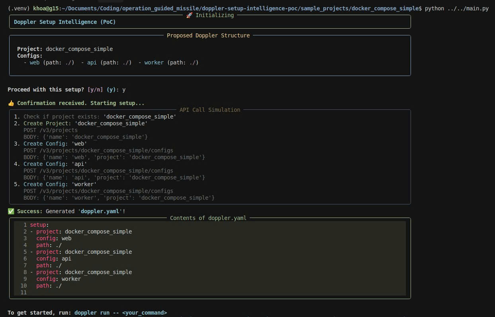

# Doppler Setup Intelligence (Proof-of-Concept)

A proof-of-concept CLI that intelligently detects a project's architecture and generates a perfect Doppler configuration in seconds.

The goal of this PoC is to demonstrate a feature that can reduce a developer's Time-to-Value with Doppler from minutes or hours to under 90 seconds.

---

## See It In Action



---

## The Value: From Friction to "Wow"

| Problem: The Current Onboarding Friction | Solution: Intelligent, Zero-Config Setup |
|---------------------------------------------|---------------------------------------------|
| Developers must read extensive documentation. | Automatically detects `docker-compose`, `monorepos`, etc. |
| Manually create configs for every service.   | Proposes a best-practice setup for the project. |
| Risk of typos and incorrect `doppler.yaml` paths. | Generates a perfect, working `doppler.yaml`. |

This PoC transforms a key point of friction into a competitive advantage, directly accelerating user activation and reinforcing Doppler's core promise of superior Developer Experience.

---

## Quick Start

### Clone & Install
```bash
git clone https://github.com/your-username/doppler-setup-intelligence-poc.git
cd doppler-setup-intelligence-poc

# Create venv and install project in editable mode
python3 -m venv .venv && source .venv/bin/activate
pip install -e ".[dev]"
```

### Run the Tests
```bash
pytest
```

### Run on a Sample Project
```bash
# Navigate to a sample project
cd sample_projects/docker_compose_simple/

# Run the intelligence engine
python ../../main.py
```